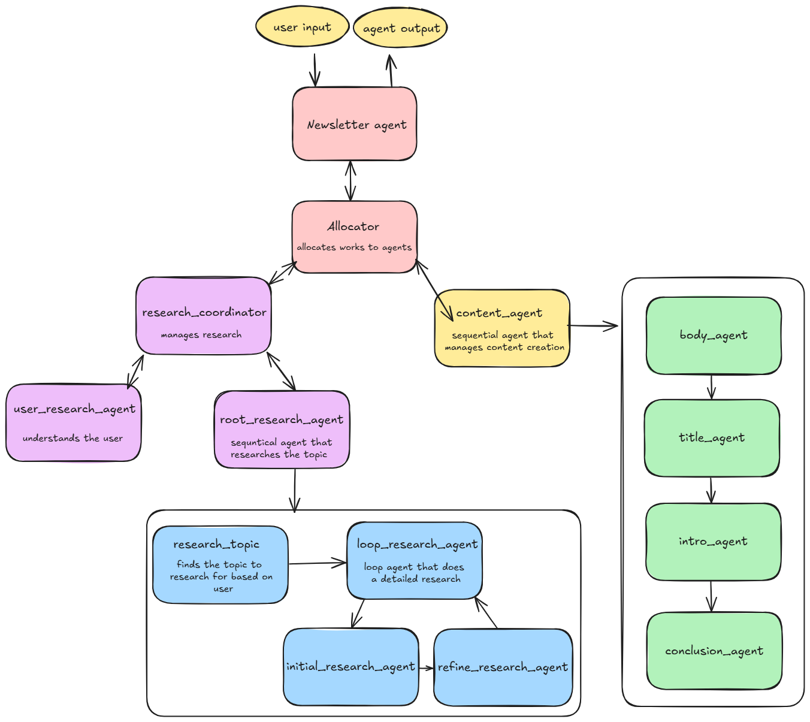

# 📰 AI Newsletter Agent

An intelligent AI agent pipeline built with **Google ADK** that generates high-quality newsletters tailored to user interests by researching topics, creating engaging content sections, and combining them into polished newsletters.

---

##  Features

-  **User profile analysis** to understand audience motivations and interests  
-  **Topic ideation** based on user input  
-  **Deep research** with iterative refinement using Google Search integration  
-  **Modular content generation**: title, introduction, body, and conclusion  
-  **Final newsletter composition** with natural flow and engaging style  
-  **Built with Google ADK** agents and tools for scalable, maintainable workflows  

---

## 📦 Project Structure

```bash
news_letter_agent/
├── agent.py                   # Main agent entrypoint
├── shared_libraries/         # Shared types and constraints
│   └── types.py              # Pydantic schemas for output
├── sub_agents/
│   ├── allocator/            # Allocator agent (task distribution)
│   ├── content/              # Content generation agents
│   └── research/             # Research agents
└── __init__.py               # Makes this a Python package
```

##  Architecture



- **`user_research_agent`**: Analyzes user profile and extracts interests  
- **`research_topic`**: Generates 3 relevant newsletter topics  
- **`initial_research_agent`** & **`refine_research_agent`**: Perform iterative research and deep analysis  
- **`loop_research_agent`**: Loops through research stages to deepen insights  
- **`root_research_agent`**: Sequential agent orchestrating research flow  
- **`research_coordinator`**: Coordinates user profiling and topic research  
- **`title_agent`**, **`intro_agent`**, **`body_agent`**, **`conclusion_agent`**: Compose newsletter sections  
- **`writer_agent`**: Combines all sections into a polished newsletter  
- **`content_agent`**: Runs the full content generation pipeline  

## ⚙️ Setup Instructions

Follow these steps to set up and run the AI Newsletter Agent locally:

### 1. Clone the Repository

```bash
git clone https://github.com/your-username/newsletter-agent.git
cd newsletter-agent
```

### 2. Create and Activate Virtual Environment

```bash
python -m venv .venv
# Activate (Windows)
.venv\Scripts\activate
# Or on macOS/Linux
source .venv/bin/activate
```

### 3. Install Dependencies

```bash
pip install -r requirements.txt
```
### 4. Configure Environment Variables

Create a `.env` file in the root directory of your project and add your Google ADK API key:

```bash
# .env
GOOGLE_API_KEY=your_api_key_here
```

### 5. Run the Agent

Make sure you're outside the `news_letter_agent/` directory before running the agent:

```bash
adk run news_letter_agent
```
### Alternative: Use the ADK Web UI

You can also run the agent using the ADK web interface, which provides an interactive chat experience along with voice input capabilities:

```bash
adk web
```

## Sample Input and Output

### User Input: 

Using Google ADK for Building AI Agents

### Agent Output:

 Hey there! Ready to dive into the world of Google AI Agents? This week, we're unpacking Google's powerful suite of tools, like Vertex AI and the Gemini API, that are transforming the AI agent landscape. Plus, we'll explore essential development best practices and how AI agents are revolutionizing industries. Keep scrolling to unlock the full potential of AI agents!

**Google's AI Agent Powerhouse**

Google is making waves in the AI agent space with its comprehensive suite of tools! From Vertex AI to the Gemini API, Google provides a robust ecosystem for building and deploying AI agents tailored to various needs. Whether you're automating tasks or enhancing user experiences, Google's offerings provide the resources necessary to bring your AI agent visions to life. Dive in and discover how to leverage these powerful tools for your next project.

**Best Practices in AI Agent Development**

Developing AI agents requires more than just technical skills; it demands a strategic approach. Key to successful implementation are clearly defined objectives that align with user needs. Embracing iterative development allows for continuous improvement and adaptation. Equally important are ethical considerations, ensuring fairness, transparency, and accountability in your AI agent's operations. By focusing on these best practices, you can build AI agents that are both effective and responsible.

**AI Agents: Transforming Industries**

AI agents are rapidly transforming industries by automating tasks, boosting efficiency, and personalizing experiences. From customer service to data analysis, these intelligent systems are making significant impacts. The market is experiencing substantial growth, with North America leading the charge. Stay ahead of the curve by exploring the diverse applications of AI agents and understanding their potential to revolutionize your industry. Now is the time to embrace AI agents and unlock new possibilities.

That's all for this week's dive into Google AI Agents! We hope you found these insights valuable. Now is the perfect time to explore how these tools can revolutionize your projects. Stay tuned for more AI innovations in our next issue!
